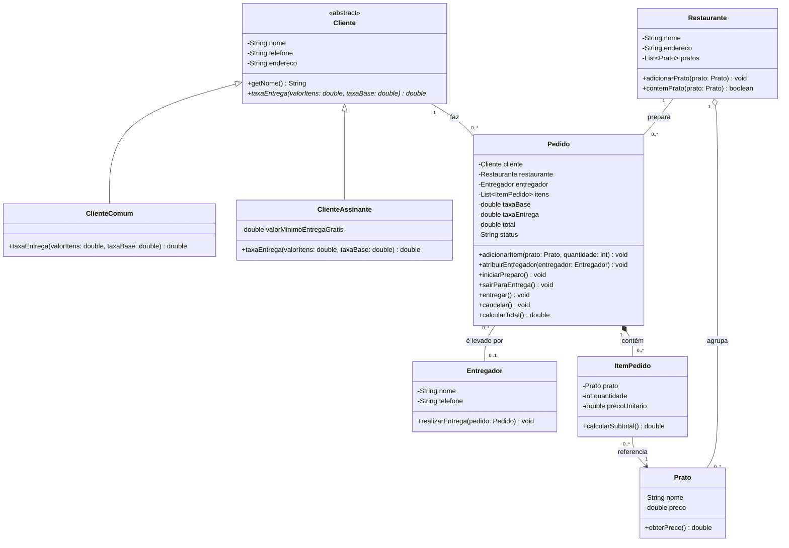

# Diagrama de classes — Delivery JáChega

Abra `diagrama-classes.drawio` no draw.io para editar a versão gráfica. Os rótulos nas duas pontas indicam multiplicidade; os losangos ficam do lado do todo.

`0..*` itens permite criar um pedido antes de adicionar pratos; `iniciarPreparo()` exige pelo menos um. `0..1` entregador permite o estado anterior à atribuição. Quando um pedido é cancelado, sua lista de itens é limpa. O prato permanece no restaurante.
